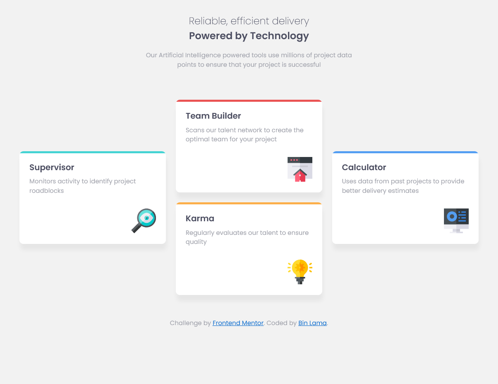

# Frontend Mentor - Four card feature section solution

This is a solution to the [Four card feature section challenge on Frontend Mentor](https://www.frontendmentor.io/challenges/four-card-feature-section-weK1eFYK). Frontend Mentor challenges help you improve your coding skills by building realistic projects.

## Table of contents

-   [Overview](#overview)
    -   [The challenge](#the-challenge)
    -   [Screenshot](#screenshot)
    -   [Links](#links)
-   [My process](#my-process)
    -   [Built with](#built-with)
    -   [What I learned](#what-i-learned)
-   [Author](#author)

**Note: Delete this note and update the table of contents based on what sections you keep.**

## Overview

### The challenge

Users should be able to:

-   View the optimal layout for the site depending on their device's screen size

### Screenshot

Desktop View


Mobile View


### Links

-   Solution: [Solution URL](https://your-solution-url.com)

## My process

-   Started by observing the design files and what changes between them.
-   Found out that two articles stay in the same position.
-   Decided to create 1 big grid and insdie there added 1 small flex box
-   learned about how to create border top
-   then started by implementing html and then styling with css.

### Built with

-   Semantic HTML5 markup
-   CSS custom properties
-   Flexbox
-   CSS Grid
-   Mobile-first workflow

### What I learned

I learned that to hide an overflow of the after pseudo class you need to use

```css
overflow: hidden;
```

on class where after pseudo class is used.

## Author

-   Frontend Mentor - [@BinLama](https://www.frontendmentor.io/profile/BinLama)
